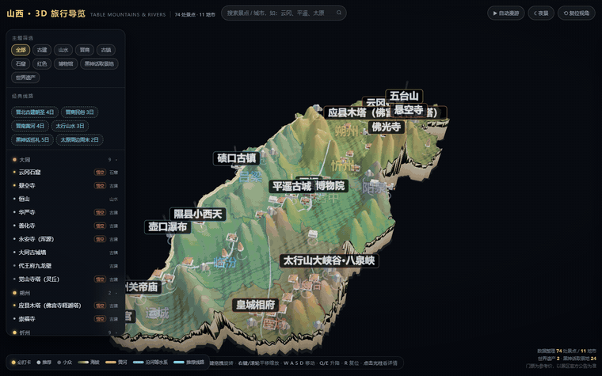
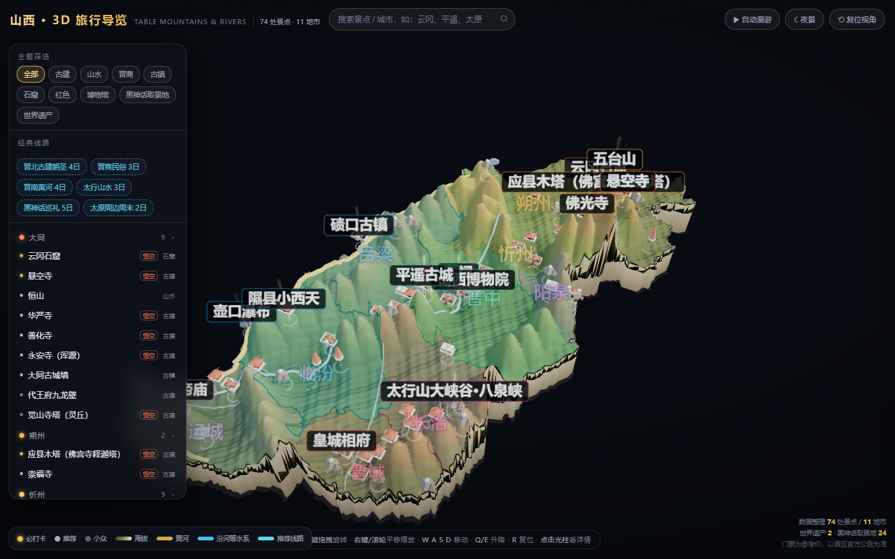
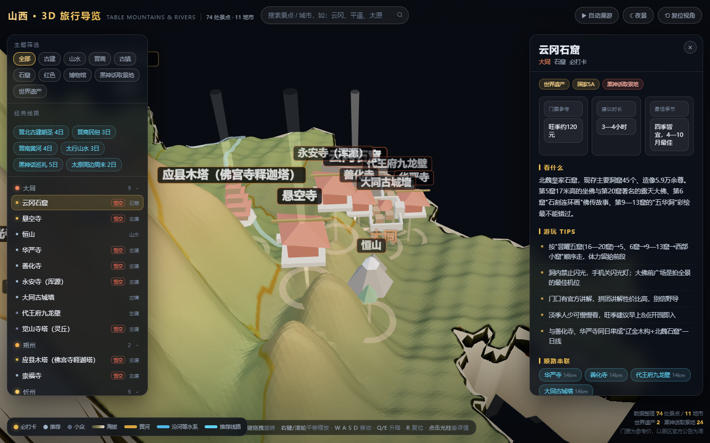
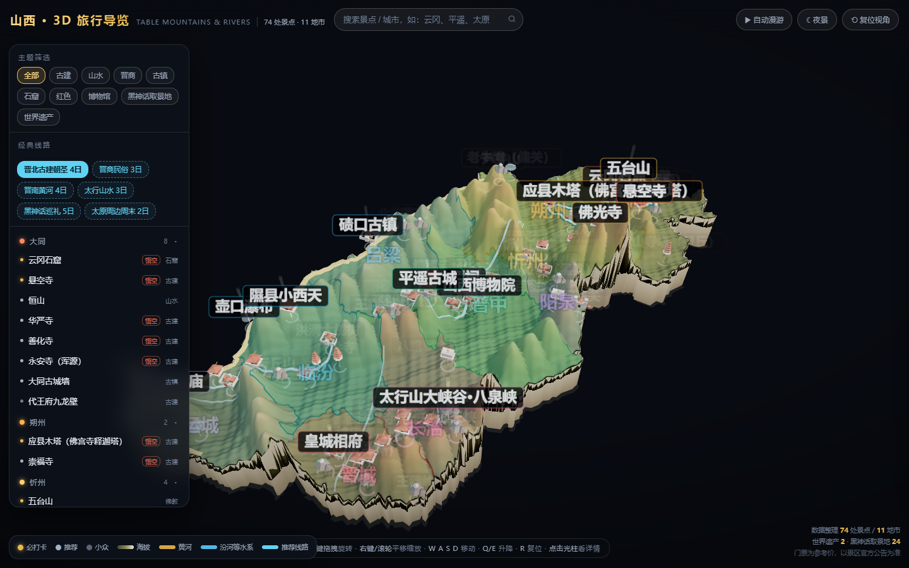
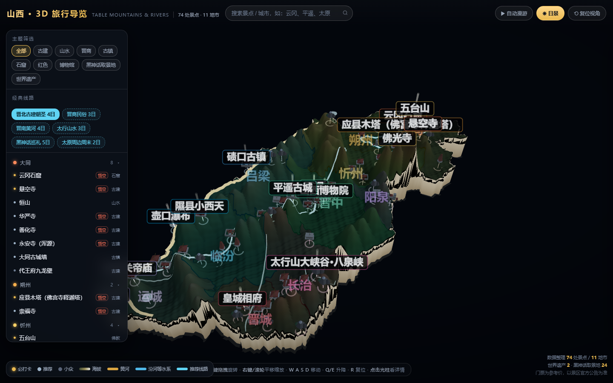

<div align="center">

# 🗺️ 3D Travel Map

**一句话：给任意地区生成一张可交互的 3D 旅行导览地图 —— 单文件 HTML，可离线双击打开**

真实行政区边界 · 低多边形地形沙盘 · 景点微缩模型 · 点击查看看点/门票/游玩 Tips · 主题筛选 · 经典线路自动巡游



**[▶ 观看完整演示视频 (MP4)](docs/demo.mp4)** · **[下载山西示例（双击即开）](examples/shanxi/山西3D旅行导览地图.html)**

`Three.js` `单文件交付` `离线可用` `数据驱动` `WorkBuddy Skill`

</div>

---

## 这是什么

输入一个行政区代码和一份景点清单，产出一张**可以直接发给同事/朋友打开**的 3D 地图：

| 输入 | 输出 |
|---|---|
| 行政区代码（如 `140000` 山西省） | 单个 HTML 文件（约 770KB，含全部依赖） |
| 景点清单（名称/坐标/看点/门票/Tips） | 3D 沙盘 + 交互式导览，无需服务器、无需联网 |

它以 [WorkBuddy Skill](#方式一作为-workbuddy-技能) 的形式组织，也可以完全手动复现——所有代码都在仓库里，不依赖任何私有服务。

## 特性

- **真实地理**：行政区边界来自阿里云 DataV GeoAtlas，按真实经纬度放置；黄河、汾河等水系沿实际走向绘制
- **地形沙盘**：按当地山脉走向（太行山/吕梁山/五台山……）程序化生成低多边形地形，盆地自动下凹，"表里山河"一眼看懂
- **景点即模型**：10 类程序化微缩模型（石窟、木塔、悬空寺、大院、关隘、瀑布……），密集区域自动避让并画引导线
- **内容即价值**：每个景点带看点详解、门票参考、建议时长、最佳季节、3~5 条实操 Tips、顺路串联推荐（自动计算最近的 4 处）
- **可玩性**：拖拽旋转 / 滚轮缩放 / WASD 漫游 / 主题筛选 / 搜索 / 6 条经典线路一键巡游 / 昼夜切换

## 效果预览

| 全景 | 景点详情 |
|---|---|
|  |  |

| 经典线路 | 夜景模式 |
|---|---|
|  |  |

## 快速开始

### 方式一：作为 WorkBuddy 技能

把本仓库克隆到技能目录，重启 WorkBuddy 后直接说"**帮我做一份 XX 的 3D 旅行地图**"：

```bash
git clone https://github.com/JayaHuang/3d-travel-map.git "$HOME/.workbuddy/skills/3d-travel-map"
```

### 方式二：手动复现（5 步）

```bash
# 0) 建项目（app/index/lib 直接用仓库里的模板，无需改动）
mkdir -p mymap/src/{data,lib}
cp assets/lib/* mymap/src/lib/
cp assets/index_template.html mymap/src/index.html
cp assets/app_template.js    mymap/src/app.js
cp assets/data/region.example.js mymap/src/data/region.js
cp assets/data/spots.example.js  mymap/src/data/spots.js
cp scripts/build_standalone.py   mymap/build.py

# 1) 抓取行政区边界（阿里云 DataV，无需 key）
python scripts/fetch_admin_geo.py 140000 --out mymap/src/data/geo.js

# 2) 填 region.js：bbox / center / scale / vert 四个必改项 + 山脉/盆地/水系/线路

# 3) 填 spots.js：景点清单（见 assets/data/spots.example.js 的字段说明）

# 4) 打包成单文件 HTML
cd mymap && python build.py --src src --out "我的3D地图.html"

# 5) 冒烟验证（可选，需要 playwright-core + chromium）
node ../scripts/smoke_test.js "我的3D地图.html" ./shots
```

## 你需要准备什么

| 内容 | 说明 | 工作量 |
|---|---|---|
| 行政区代码 | 国标 adcode，6 位（省/市均可） | 1 分钟 |
| `region.js` | 外接框、比例尺、山脉走向、经典线路 | 30 分钟 |
| `spots.js` | 景点清单：坐标、看点、门票、Tips | **主要工作量**，参见 [content-guide.md](references/content-guide.md) |

> 内容写作有讲究：看点多写"具体名称/编号/数据"，少写形容词；门票无法核实就写"以现场为准"；官方名单类标签（如世界遗产）必须核对官方来源。完整规范见 [`references/content-guide.md`](references/content-guide.md)。

## 配置一览（region.js）

| 字段 | 说明 | 示例 |
|---|---|---|
| `bbox` | `[最小经度, 最小纬度, 最大经度, 最大纬度]` | `[110.10, 34.55, 114.62, 40.92]` |
| `center` | 区域内部参考点（用于把界外河流点拉回境内） | `[112.35, 37.75]` |
| `scale` | 每纬度对应的世界单位，经验值 `900 / 纬度跨度` | `9.2` |
| `vert` | 高程夸张系数，山地 2~3、平原 1.5~2 | `2.45` |
| `cityOrder` | 左侧分组排序 | `['大同','朔州',...]` |
| `extraFilters` | 分类之外的筛选器 `{label, test(s)}` | 黑神话取景地、世界遗产 |
| `RG_RANGES` | 山脉：每条 3~6 个中心点 + 半径 + 高度 | 见 `assets/data/region.example.js` |
| `RG_BASINS` | 盆地（下凹区域） | 同上 |
| `RG_RIVERS` | 水系折线 | 同上 |
| `RG_ROUTES` | 经典线路 `{n, ids[]}` | 同上 |

## 示例：山西省

[`examples/shanxi/`](examples/shanxi/) 内含完整可打开的成品与全部数据源，可直接当作填数模板抄：

| 指标 | 数值 |
|---|---|
| 景点 | 74 处（必打卡 20 / 推荐 30 / 小众 24） |
| 覆盖 | 11 个地市 |
| 世界遗产 | 3 处（云冈石窟、平遥古城、五台山） |
| 黑神话取景地 | 27 处（按山西省文物局官方名单标注） |
| 经典线路 | 6 条（晋北古建 / 晋商民俗 / 晋南黄河 / 太行山水 / 黑神话巡礼 / 太原周边） |

## 技术要点

细节与踩坑记录见 [`references/threejs-map-recipes.md`](references/threejs-map-recipes.md)，几个关键决策：

- **three.js r147（UMD）**：r148 起移除非 module 版 OrbitControls，r147 是"双击 HTML 直接跑"的最后版本
- **一张 canvas 两用**：省界遮罩同时作为地市色块贴图与 `alphaTest` 裁切掩模，边界干净且不进透明渲染队列
- **山脉用高斯脊取 max 而非累加**：避免多中心点叠加炸出尖峰；半径经验值 0.15°~0.19°
- **标签屏幕恒定尺寸**：`sizeAttenuation:false` + 按推荐等级分级显示，74 个标签不糊屏
- **线路飘带不用 AdditiveBlending**：亮背景上会白化，改为"暗色描边带 + 亮色主线"

## 目录结构

```
3d-travel-map/
├── SKILL.md                     # 技能入口（WorkBuddy 加载）
├── assets/
│   ├── app_template.js          # 通用 3D 主程序（区域差异全部抽到配置，换地区零改代码）
│   ├── index_template.html      # 页面骨架
│   ├── data/region.example.js   # 区域配置模板（山西省完整示例）
│   ├── data/spots.example.js    # 景点数据结构说明
│   └── lib/                     # three.js r147 + OrbitControls（离线可用）
├── scripts/
│   ├── fetch_admin_geo.py       # adcode → 简化边界 geo.js
│   ├── build_standalone.py      # 内联为单文件 HTML
│   ├── smoke_test.js            # 无头浏览器冒烟测试
│   └── make_media.js            # 生成演示截图与分镜序列帧
├── references/
│   ├── threejs-map-recipes.md   # 技术配方 + 13 条踩坑记录
│   └── content-guide.md         # 内容调研与写作规范
├── docs/                        # 演示素材（GIF / MP4 / 截图）
└── examples/shanxi/             # 山西省完整示例（成品 + 数据源）
```

## 生成演示素材（GIF / MP4 / 截图）

无头浏览器软渲染只有 ~3 FPS，直接录屏会卡成幻灯片。正确做法是**逐帧摆机位**：每帧显式设置相机位姿再截图，最后用 ffmpeg 按 10~12fps 编码，得到流畅演示。

```bash
# 1) 截取 4 张关键帧 + 62 张分镜序列帧
node scripts/make_media.js "我的3D地图.html" ./media

# 2) 序列帧 → GIF（两遍调色板，体积可控）
ffmpeg -framerate 10 -i media/frames/f%02d.png   -vf "scale=760:-1:flags=lanczos,split[a][b];[a]palettegen=max_colors=128[p];[b][p]paletteuse=dither=bayer:bayer_scale=4"   -loop 0 demo.gif

# 3) 序列帧 → MP4
ffmpeg -framerate 12 -i media/seq/s%03d.png -vf "scale=1280:-2"   -c:v libx264 -crf 22 -pix_fmt yuv420p -movflags +faststart demo.mp4
```

> ffmpeg 建议用 `pip install imageio-ffmpeg` 自带的完整版；Playwright 自带的 ffmpeg 是裁剪版（无 libx264 / palettegen）。

## 已知限制

- 地形山体为程序化示意（按真实山脉走向拟合），不是真实 DEM 高程；需要精确高程可自行替换高度函数
- 行政区边界做了抽稀简化（省界 791 → 375 点），放大到街区级会有棱角
- 无头软渲染约 3 FPS，仅用于自动化验证；真机 GPU 60 FPS 无压力（23 万三角形 / ~870 mesh）

## License

[MIT](LICENSE) · 演示数据（景点介绍/门票）整理自公开资料，出行前请以景区官方公告为准。
